Computational Optimal Transport - Codes
------

This directory contains the Matlab codes to reproduce the figure from the book.

The output files of the scripts are generated in directory results/. The directory toolbox/ contains helper functions.

You can find bellow a representative example of figure generated by each sub-directory. The name of the image file matches the name of the directory.

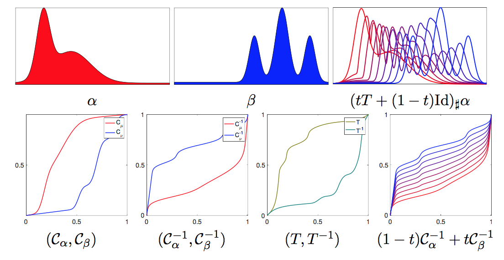
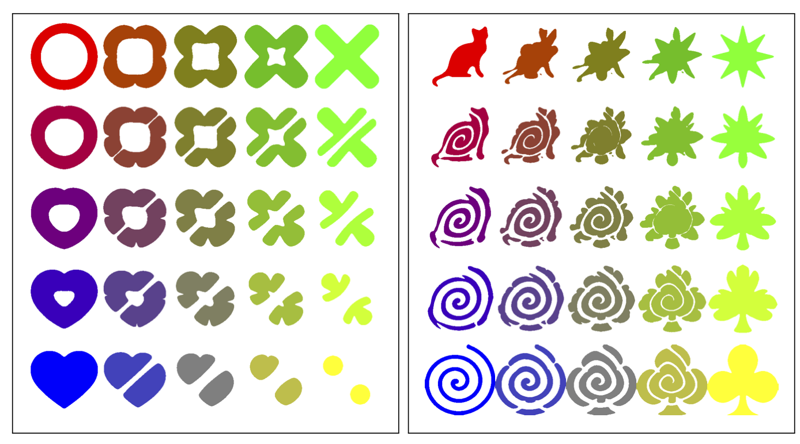
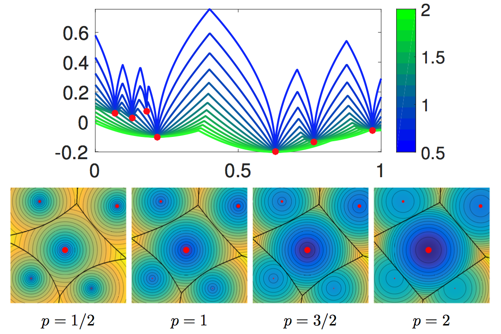
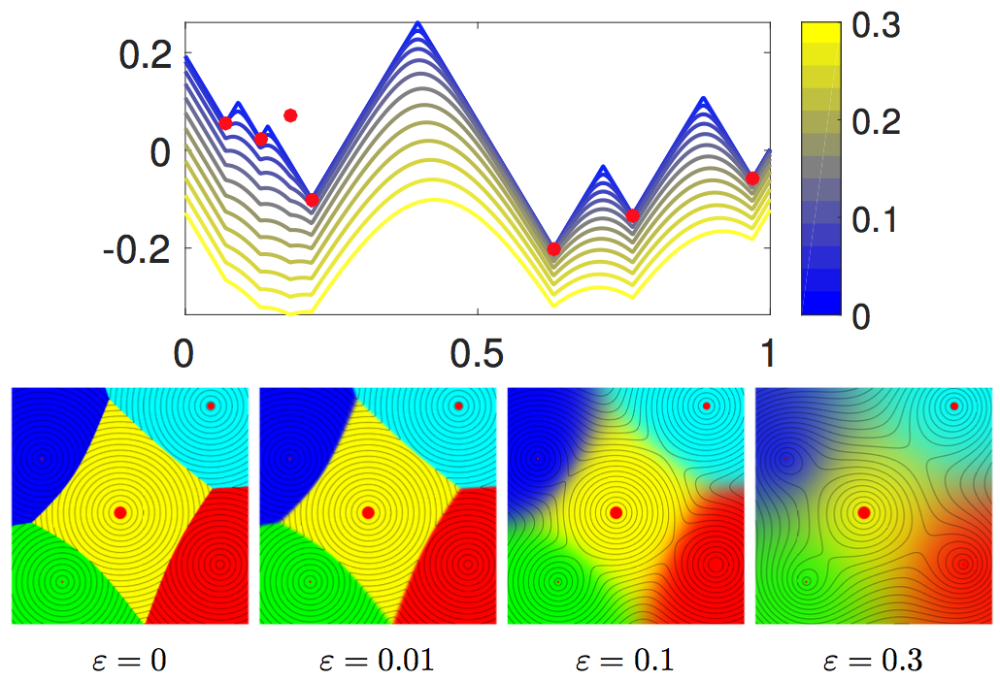
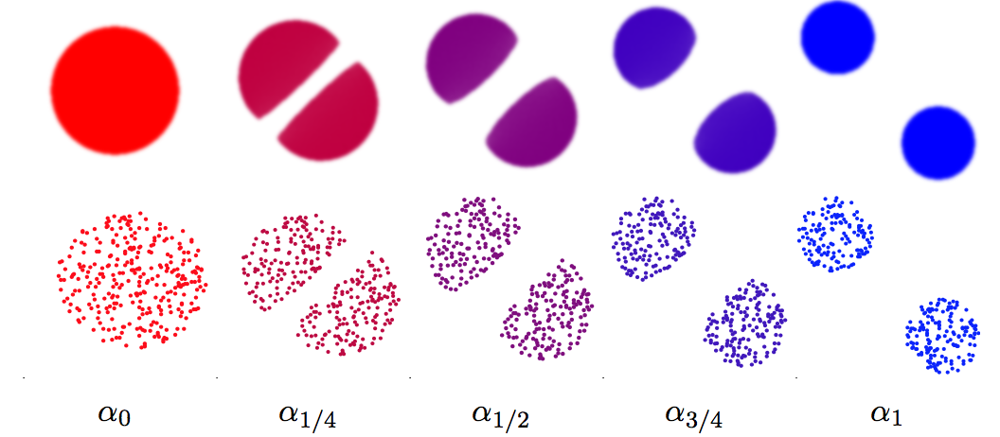

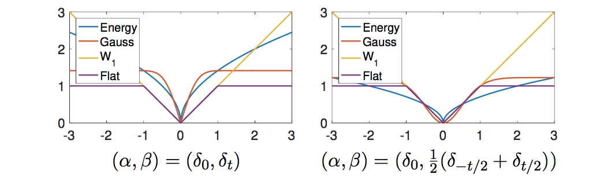
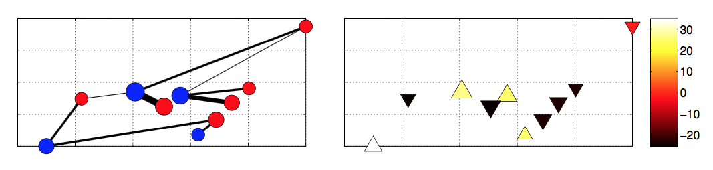
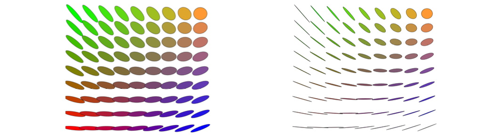
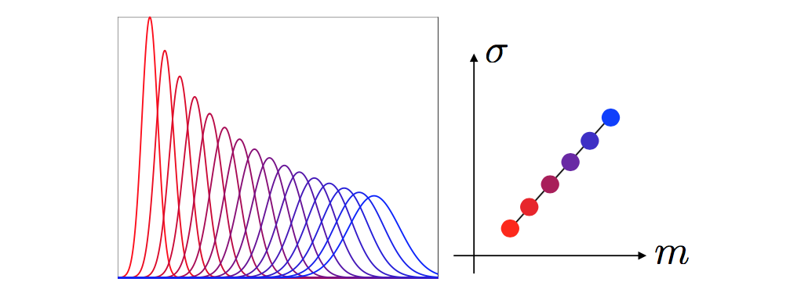
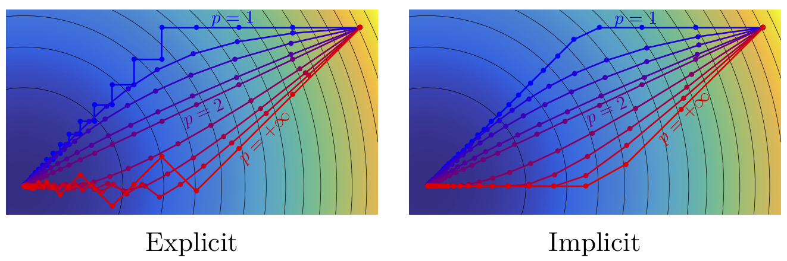
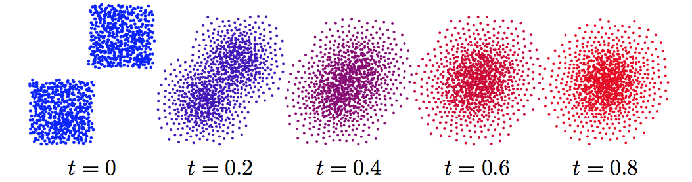
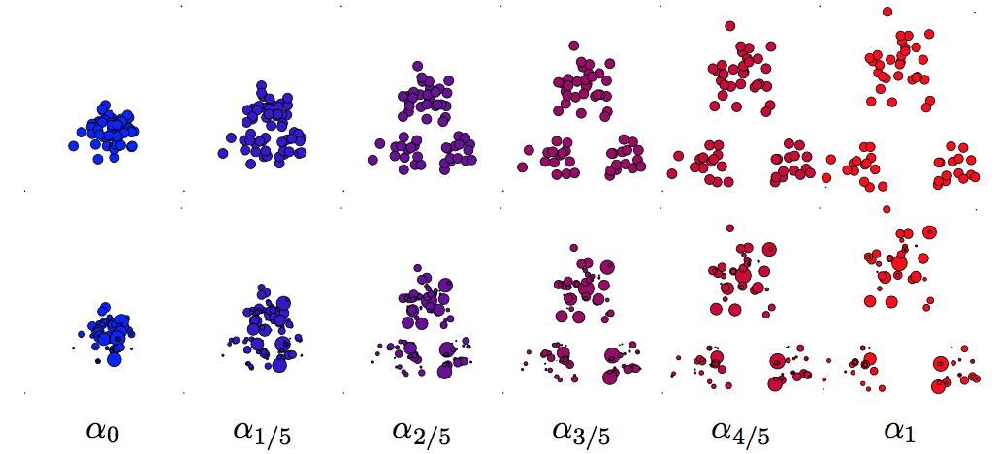
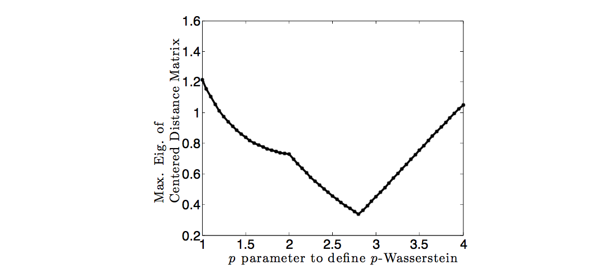
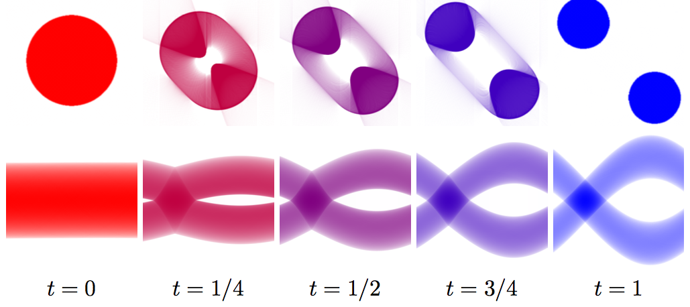
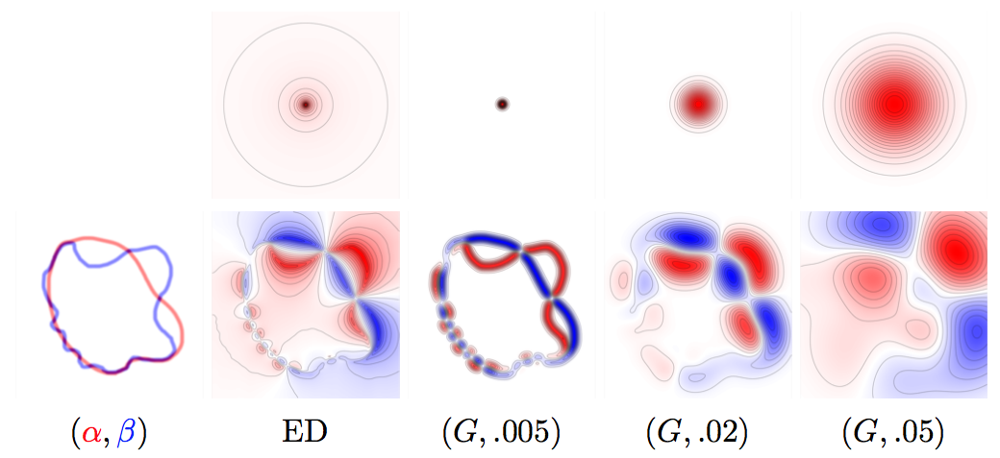
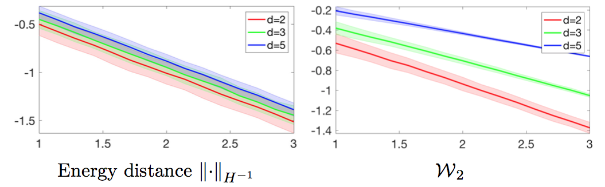
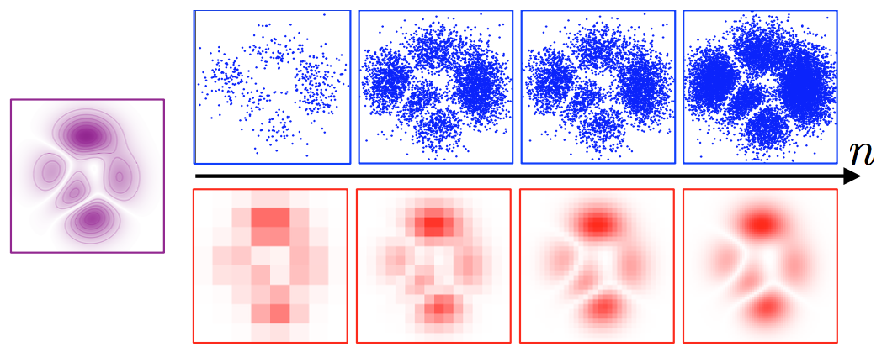
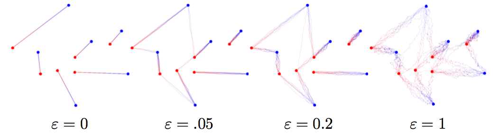
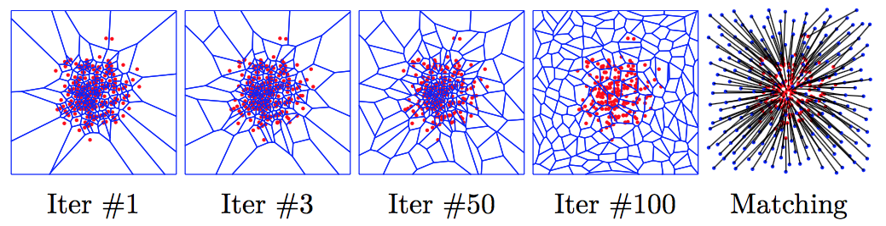
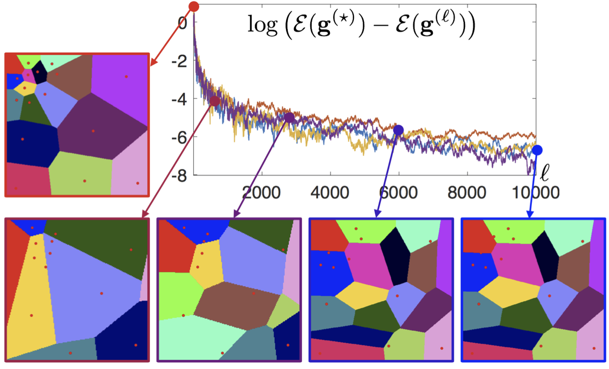
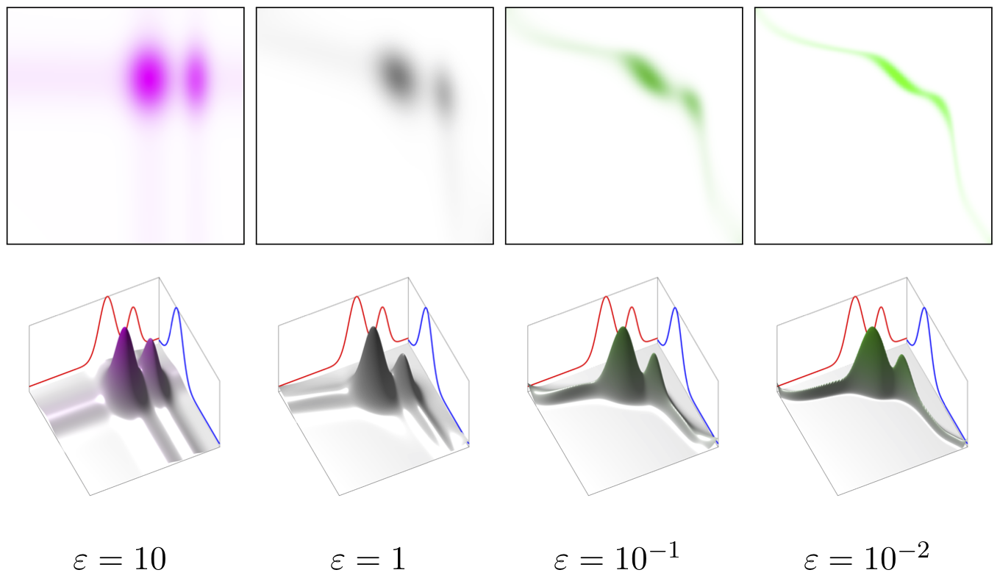
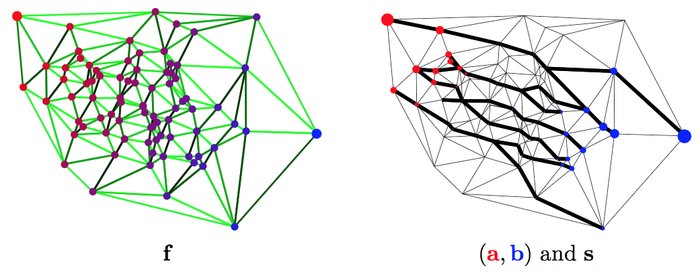

Copyright (c) 2017 Gabriel Peyre and Marco Cuturi
